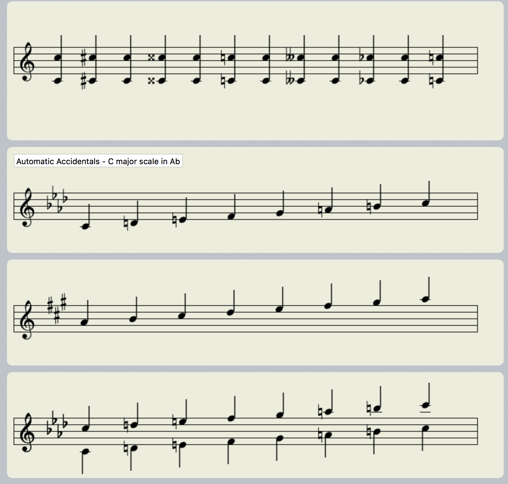
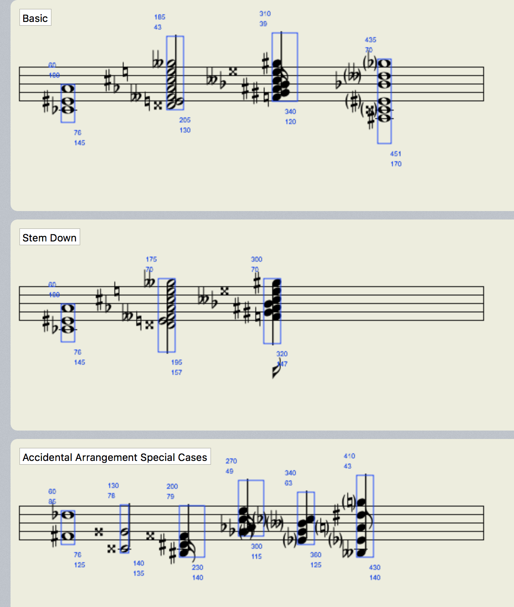

# MusicNotation

Introducing <b>MusicNotation</b> 
Scott's' iOS-based music notation library for rendering with musical scores. 
Based on <a href="https://github.com/0xfe/vexflow">VexFlow </a>.

## Features

- Renders all common (and some uncommon) music notation
- Draws notes, staffs, formats and customizes
- Time Signatures, Accidentals, etc.
- Simple to use object heirarchy for drawing to UIView or CALayer
- Highly customizable.

 

## Requirements

- Requires iOS 9 or OS X 10.11
- Requires Automatic Reference Counting (ARC)

## Applications

...None yet.

## Coming Soon

- Tab notation
- Animations
- Stability enhancements and bug fixes
- Documentation
- Notation Language

## Suggestions

- Open source framework and Cocoapods support

## Notes

To enable verbose debugging output, modify file: RhythmTrainer-PrefixHeader.pch
static const int ddLogLevel = DDLogLevelOff; // LOG_LEVEL_VERBOSE;

## Copyright

Copyright (c) Scott Riccardelli 2015  
slcott <s.riccardelli@gmail.com> https://github.com/slcott

Permission is hereby granted, free of charge, to any person obtaining a copy of this software and associated documentation files (the "Software"), to deal in the Software without restriction, including without limitation the rights to use, copy, modify, merge, publish, distribute, sublicense, and/or sell copies of the Software, and to permit persons to whom the Software is furnished to do so, subject to the following conditions:

The above copyright notice and this permission notice shall be included in all copies or substantial portions of the Software.

THE SOFTWARE IS PROVIDED "AS IS", WITHOUT WARRANTY OF ANY KIND, EXPRESS OR
IMPLIED, INCLUDING BUT NOT LIMITED TO THE WARRANTIES OF MERCHANTABILITY,
FITNESS FOR A PARTICULAR PURPOSE AND NONINFRINGEMENT. IN NO EVENT SHALL THE
AUTHORS OR COPYRIGHT HOLDERS BE LIABLE FOR ANY CLAIM, DAMAGES OR OTHER
LIABILITY, WHETHER IN AN ACTION OF CONTRACT, TORT OR OTHERWISE, ARISING FROM,
OUT OF OR IN CONNECTION WITH THE SOFTWARE OR THE USE OR OTHER DEALINGS IN
THE SOFTWARE.
